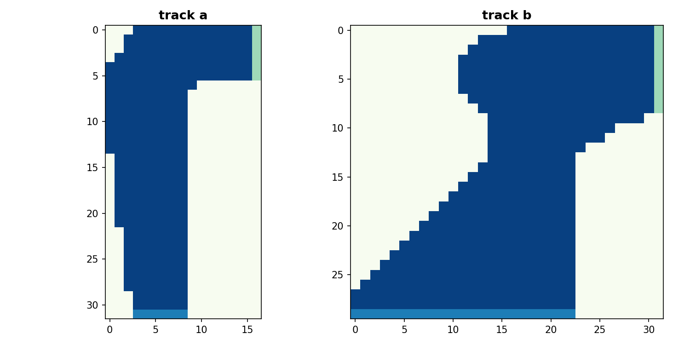

# Q-Learning Racetrack Simulation

A reinforcement learning project that trains an agent to navigate a racetrack using Q-learning algorithm.

## Project Overview

This project implements a Q-learning agent that learns to drive a car around a racetrack. The agent learns to navigate from a starting line to a finish line while avoiding going off-track. The environment is built using a custom Gymnasium-compatible interface with Pygame visualization.

## Features

- Custom race track environment with two different track layouts
- Q-learning implementation for training the agent
- Visualization of the trained agent's performance using Pygame
- State representation includes position and velocity components
- Configurable learning parameters

## Installation

1. Clone this repository:
```
git clone https://github.com/yourusername/RLRacetrack.git
cd RLRacetrack
```

2. Install the required dependencies:
```
pip install -r requirements.txt
```

## Usage

### Running the Trained Agent

To see the trained agent navigate the racetrack:

```
python main.py
```

This will load the pre-trained Q-table and run the agent on track B with visualization.

### Training a New Agent

To train a new Q-learning agent:

```
python training/q_learning.py
```

This will train the agent for 5000 episodes and save the resulting Q-table to `training/q_table.npy`.

## Environment Details

The racetrack environment is defined in `race_track_env/race_track_env.py` and includes:

- State space: (row, col, y_speed, x_speed)
- Action space: 9 possible acceleration combinations
- Rewards: -1 for each step, -10 penalty for going off-track, 0 for reaching the finish line
- Two track layouts (A and B) with different complexity levels

## Q-Learning Implementation

The Q-learning algorithm is implemented with the following parameters:
- Learning rate: 0.8
- Discount factor: 0.95
- Exploration probability: 0.2
- Training episodes: 5000
- Max steps per episode: 500

## Project Structure

```
RLRacetrack/
├── main.py                      # Main script to run the trained agent
├── requirements.txt             # Project dependencies
├── README.md                    # Project documentation
├── LICENSE                      # License file
├── race_track_env/              # Custom environment package
│   ├── race_track_env.py        # Environment implementation
│   └── maps/                    # Track layouts
│       ├── build_tracks.py      # Script to generate track layouts
│       ├── maps.png             # Visualization of track layouts
│       ├── track_a.npy          # Track A layout data
│       └── track_b.npy          # Track B layout data
└── training/                    # Training scripts and data
    ├── q_learning.py            # Q-learning implementation
    └── q_table.npy              # Trained Q-table
```

## Screenshots


*Visualization of the two track layouts available in the environment*

## Future Improvements

- Implement additional reinforcement learning algorithms (SARSA, DQN)
- Add more complex track layouts
- Implement a graphical user interface for parameter tuning
- Add performance metrics and visualization of learning progress

## License

This project is licensed under the MIT License - see the LICENSE file for details.